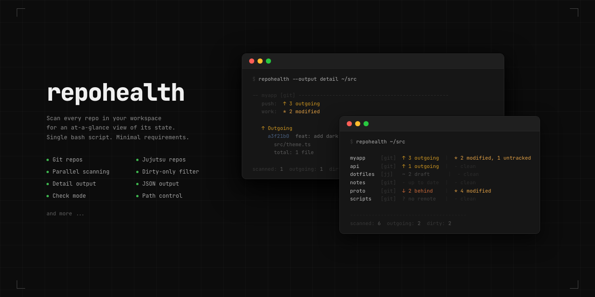

<div align="center">
  <h1>repohealth</h1>
  <p>
    <a href="./LICENSE">
      
    </a>
    <a href="https://github.com/frittlechasm/repohealth">
      
    </a>
  </p>
  
  <p><em>Scan every repo in your workspace and get a quick overview of its state.</em></p>
</div>

## Install

macOS and Linux:

```bash
curl -fsSL https://raw.githubusercontent.com/frittlechasm/repohealth/main/install.sh | sh
```

Windows PowerShell:

```powershell
iwr https://raw.githubusercontent.com/frittlechasm/repohealth/main/install.ps1 -UseB | iex
```

By default, macOS and Linux install to `~/.local/bin/repohealth` and update your shell profile when that directory is not already on `PATH`. Windows installs to `%LOCALAPPDATA%\Programs\repohealth`, creates a `repohealth.cmd` launcher, and adds that directory to the current session and user `PATH`. Open a new terminal after installation if your shell does not pick up `PATH` changes immediately.

To choose a directory:

```bash
curl -fsSL https://raw.githubusercontent.com/frittlechasm/repohealth/main/install.sh | sh -s -- --dir "$HOME/bin"
```

```powershell
$env:REPOHEALTH_INSTALL_DIR="$HOME\bin"; iwr https://raw.githubusercontent.com/frittlechasm/repohealth/main/install.ps1 -UseB | iex
```

For a local checkout, `chmod +x ./repohealth` is enough.

Requires `bash`, `find`, `awk`, `git`. On Windows, install Git for Windows or another Bash provider first. Optionally `jj` for Jujutsu repos, `fd` for faster discovery.

## Usage

```bash
./repohealth [options] [directory]
```

If `directory` is omitted, the current directory is scanned.

| Flag | Description |
|------|-------------|
| `-f`, `--filter TYPE` | show repos matching `dirty`, `uncommitted`, `unpushed`, `unpulled`, or `all` |
| `-n`, `--depth N` | limit traversal depth |
| `-c`, `--check` | exit non-zero when any repo needs attention |
| `-e`, `--exclude PATTERN` | skip repos whose path matches the ERE (repeatable) |
| `-r`, `--remote NAME` | override remote used for Jujutsu push checks |
| `-j`, `--jobs N` | limit parallel workers (default: auto, floor 8) |
| `-o`, `--output FORMAT` | `table` · `minimal` · `detail` · `fancy-detail` · `json` |
| `-p`, `--paths STYLE` | `name` (default) · `relative` · `full` |
| `-N`, `--no-color` | disable ANSI color output |

## Output

Each row shows push state on the left and working-copy state on the right:

```
myapp     [git]  ↑ 3 outgoing  |  * 2 modified, 1 untracked
dotfiles  [jj]   ~ 2 draft     |  - clean
notes     [git]  - up to date  |  - clean
```

### Push Statuses

| Status | Meaning |
|--------|---------|
| `- up to date` | local branch matches the remote |
| `↑ N outgoing` | local commits are ready to push |
| `↓ N behind` | remote has commits not present locally |
| `↕ A ahead, B behind` | local and remote both have unique commits |
| `~ N draft only` | Jujutsu repo has draft changes but no Git push is needed |
| `! N no-desc` | Jujutsu changes need descriptions before push |
| `? no remote` | repo has no usable remote for push checks |

### Work Statuses

| Status | Meaning |
|--------|---------|
| `- clean` | no working-copy changes |
| `* N modified` | tracked files have local changes |
| `* N untracked` | untracked files are present |
| `* M modified, U untracked` | tracked and untracked changes are both present |

### Filters

Filters limit which repos appear in the list. Without `--filter`, repohealth shows repos with uncommitted, unpushed, or unpulled changes.

| Filter | Shows |
|--------|-------|
| `dirty` | repos with working-copy changes |
| `uncommitted` | same as `dirty` |
| `unpushed` | repos with outgoing commits, draft-only JJ changes, or no-description JJ commits |
| `unpulled` | repos behind the remote |
| `all` | every scanned repo, including clean repos |

### Output Details

| Output | Shows |
|--------|-------|
| `table` | one row per repo with push and work status |
| `minimal` | compact repo names and statuses for quick scans |
| `detail` | table output plus per-commit stat details |
| `fancy-detail` | detailed output with richer terminal formatting |
| `json` | machine-readable repo data for scripts |

## How it works

- Single self-contained Bash script — no build step, no daemon, no framework.
- Discovers `.git` and `.jj` repos recursively; prefers `jj` when both exist at the same root.
- Collects repo state in bounded parallel batches; renders in sorted path order for stable output.
- Uses `fd`/`fdfind` when available for faster traversal, falls back to `find`.
- Skips `node_modules`, `vendor`, `target`, `__pycache__`, `.svn`, `.hg`, and linked Git worktrees.
- Repo rows go to stdout; warnings and errors go to stderr.
